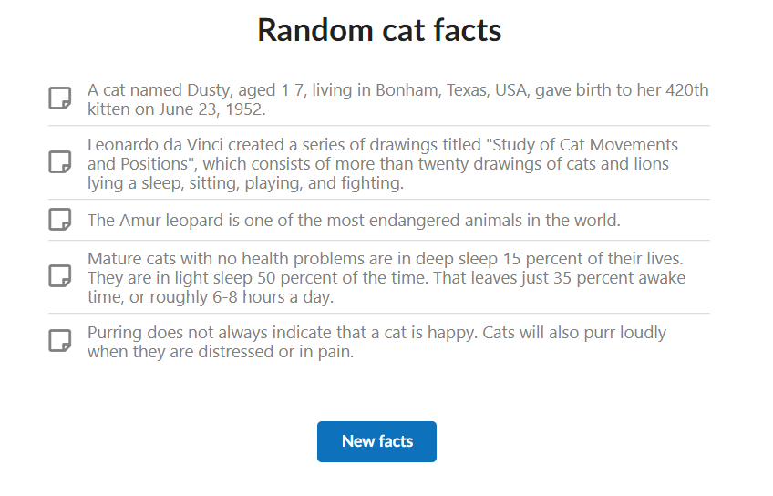

React app fetching 5 randon facts about cats. 

Deployed on Heroku here https://cat-facts-react.herokuapp.com/

Was done as a test assignment.

Tests implemented with Jest.
User interface styled with SemanticUI

